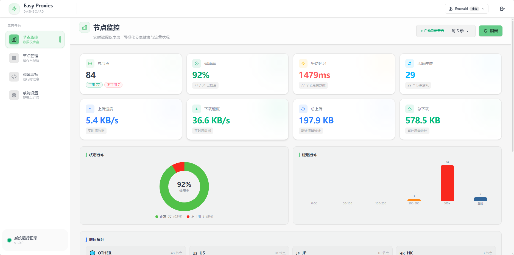
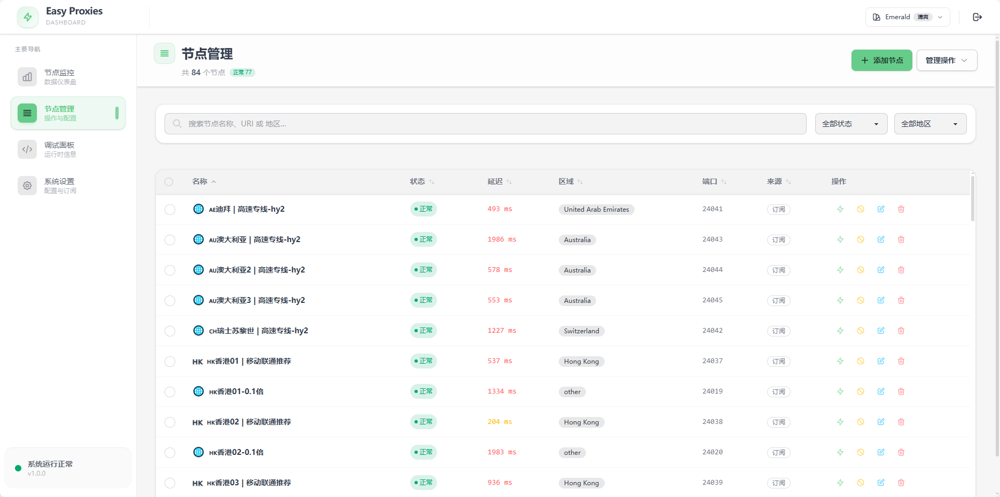
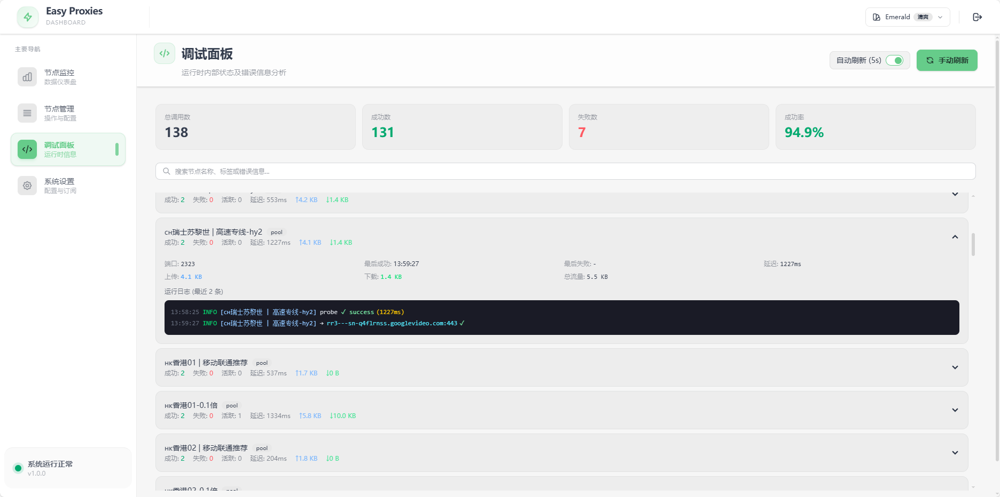
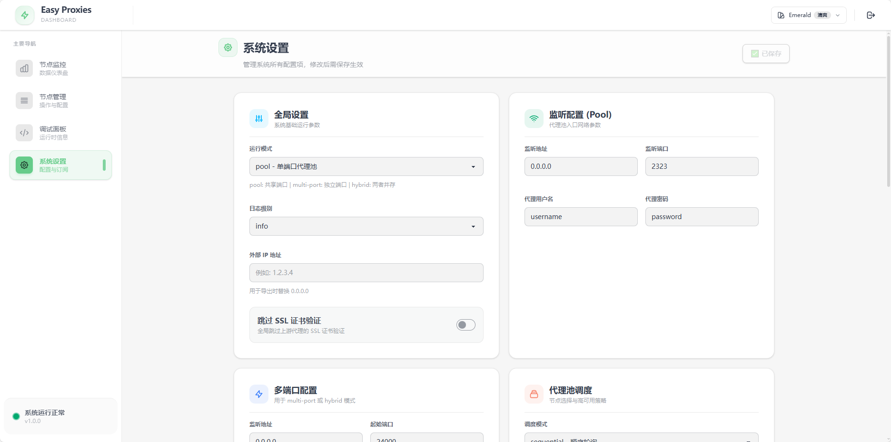

# EasyProxiesV2

EasyProxiesV2 是一个轻量级、高性能的代理池与订阅管理工具，底层基于 [sing-box](https://github.com/SagerNet/sing-box)。
项目内置现代化 Web 管理面板，支持节点健康检查、订阅刷新、流量监控与可视化管理。

> 二开声明：本项目基于 [jasonwong1991/easy_proxies](https://github.com/jasonwong1991/easy_proxies) 二次开发，V2 版本重点重构了前端与工程化流程。

## ❤️ 赞助木木

木木是独立开发者 / 开源爱好者，长期投入开源项目维护与迭代。
如果 EasyProxiesV2 对你有帮助，或者你认可我的工作，欢迎请我喝杯咖啡。你的支持是我持续创造的动力源泉 ⚡

- [赞助地址](https://mumuverse.space:1588/)

---

## ✨ 核心特性

- 现代化 Web UI（React + Vite + Tailwind + DaisyUI）
- 前后端一体化（前端静态资源已内嵌到 Go 二进制，单文件即可运行）
- 节点订阅与自动刷新
- 代理池智能调度与故障隔离
- GeoIP 分区路由（可选）
- SQLite 持久化存储运行状态与统计数据

## 🖼️ 项目预览







---

## 🚀 最推荐：直接使用 Release 二进制（Linux / Windows）

你不需要本地安装 Go 和 Node，直接下载发布产物即可使用。

### 1) 下载文件

从 GitHub Releases 下载这两个文件之一：

- Linux: `easy-proxies-linux-amd64`
- Windows: `easy-proxies-windows-amd64.exe`

并同时准备配置文件：

- 将仓库里的 `config.example.yaml` 复制为 `config.yaml`
- 按需修改端口、账号密码、订阅链接等

---

## 🐧 Linux 使用方法

### 1) 赋予执行权限
```bash
chmod +x ./easy-proxies-linux-amd64
```

### 2) 准备配置
```bash
cp ./config.example.yaml ./config.yaml
```

### 3) 启动程序
```bash
./easy-proxies-linux-amd64 --config ./config.yaml
```

### 4) 访问管理面板
默认访问地址：
- `http://127.0.0.1:9888`（本机）
- 或 `http://<服务器IP>:9888`
- 默认密码：`123456`
> 默认管理监听来自配置项 `management.listen`，默认值见 `config.example.yaml`。

---

## 💻 Windows EXE 使用方法

### 1) 准备文件
把下面两个文件放到同一目录：

- `easy-proxies-windows-amd64.exe`
- `config.yaml`（由 `config.example.yaml` 复制并修改）

### 2) 启动程序（PowerShell 或 CMD）
```powershell
.\easy-proxies-windows-amd64.exe --config .\config.yaml
```

### 3) 访问管理面板
浏览器打开：
- `http://127.0.0.1:9888`

---

## ⚙️ 配置说明（最小必读）

配置模板见 `config.example.yaml`，重点关注：

- `mode`: `pool` / `multi-port` / `hybrid`
- `listener`: 代理入口监听与认证（新增 `listener.protocol`: `http` / `socks5` / `mixed`）
- `multi_port`: 多端口入口参数（新增 `multi_port.protocol`: `http` / `socks5` / `mixed`）
- `management.listen`: Web 管理面板地址（默认 `0.0.0.0:9888`）
- `management.password`: 面板登录密码（为空则不需要登录）
- `subscriptions` / `nodes_file` / `nodes`: 节点来源（三选一或混用）

### TXT 代理订阅

项目额外支持 `txt_subscriptions`，适用于 GitHub TXT 代理列表或普通 TXT 代理地址列表。

- 支持 GitHub `blob` 链接，程序会自动转换为 `raw` 地址
- 支持每行已经带协议的格式，例如 `http://1.0.170.50:80`
- 支持每行只有 `ip:port` 的格式，例如 `1.0.171.213:8080`
- 对于 `ip:port` 格式，需要在该 TXT 订阅上配置 `default_protocol`，可选 `http` / `https` / `socks5`
- 每个 TXT 订阅都可以单独设置 `auto_update_enabled`，决定它是否参与自动更新

示例配置请查看 `config.example.yaml` 中的 `txt_subscriptions` 注释块。

---

## 🧪 从源码构建（开发者）

项目由 Go (1.24+) + Node (22+) 构成。

### 1) 构建前端
```bash
cd frontend
npm ci
npm run build
```

### 2) 构建后端
```bash
go mod download
go build -tags "with_utls with_quic with_grpc with_wireguard with_gvisor" -o easy-proxies ./cmd/easy_proxies
```

---

## 📦 Docker（可选）

如果你偏好容器部署，可使用现成的 `Dockerfile` 与 `docker-compose.yml`：

```bash
docker build -t easy-proxies:latest .
docker compose up -d
```

## 📁 目录结构简述

- `cmd/easy_proxies/`: Go 程序入口
- `frontend/`: 前端源码
- `internal/`: 后端核心模块
- `internal/monitor/assets/`: 前端构建产物（会被 Go embed）
- `.github/workflows/build-and-release.yml`: 自动构建与发布流程

---

## 🙏 鸣谢

- 原作者 [jasonwong1991/easy_proxies](https://github.com/jasonwong1991/easy_proxies)
- 核心代理引擎 [sing-box](https://github.com/SagerNet/sing-box)
